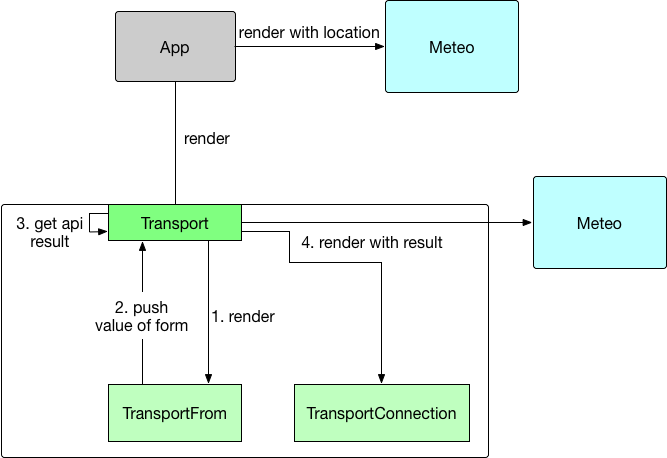

# HomePage
This is my personal Homepage. I'm still working on several features and improvements.

## Usage

### Dist

You can use the version currently built in the folder `dist`.
Download files on `dist` and launch `index.html` on your browser.
Or clone this project :

```bash
    $ git clone https://github.com/jzaehrin/homepage.git
```

### Building

You can rebuild the solution with npm :
```bash
    $ git clone https://github.com/jzaehrin/homepage.git
    $ npm install
    $ npm run prod
```

The solution is built on the folder `dist`. Run `index.html` on your browser.

#### Personalization (non-userfriendly)

One of the feature gives weather informations on your prefered location.
First you have to set up the configuration as follow :  
- open the file `src/components/App/App.js`
- find the attribute named `location`
- Fill it with a correct name from this [link](http://www.prevision-meteo.ch/services/json/list-cities "title" target="_blank").


### Problem

The type of `input`used are only supported by a few browsers.
Check [here](http://caniuse.com/#feat=input-datetime "title" target="_blank") which browser is compatible with this app.

The application is built in ECMAScript 5, you can check the compatibility informations [here](http://caniuse.com/#feat=es5)

## Features

### Weather forecasting

When you start the application, a first block appears with the current weather informations set in the file `src/components/App/App.js`.

In the future, this location will be inserted by the user at the first start. Or by using geolocation of the browser.

### Transport

A form is displayed to search a route in public transport. This API supports main swiss public transports.
The autocompletion is provided by the same API.

#### Weather forecasting paired with transport

The weather displayed in the fourth block (bottom right) is the weather from the first potential arrival (automatically calculated via the search travel block)

##### Geoname
It may be possible that the city name you entered in the search travel block aren't supported by the Weather forecast API.
When this occurs, i get GPS latitude and longitude from Geoname API and i send it at the weather API to get approximate results.

#### Problems

I tried to implement an event listing at the entered destination - tested 2 event API without success.

The first one is [api.myswitzerland](http://api.myswitzerland.com/), no information was provided on how to get the apikey.

The second one is [eventful](http://api.eventful.com/), they provide a js library but the direct request are sent without CORS headers.

## Structure
The structure is based around React using babel to transpile es6 to es5 and webpack to bundle the whole project.

On this graph, you can look all the components and different interactions between them.


## Links

1. Transport API
  * [Official website](https://transport.opendata.ch/)
2. Prevision meteo API
  * [Official website](http://www.prevision-meteo.ch/services)
3. Material-ui - React component based on Material Design
  * [Official website](http://www.material-ui.com/)
4. ReactJS
  * [Officail website](https://facebook.github.io/react/)
5. Babel
  * [Official website](https://babeljs.io/)
  * [npmjs page](https://www.npmjs.com/package/babel-loader)
6. Webpack
  * [Official website](https://webpack.github.io/docs/)
  * [npmjs page](https://www.npmjs.com/package/webpack)
